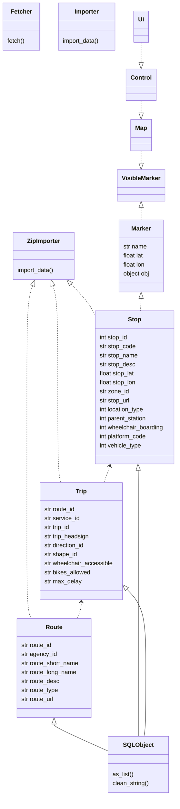

# Arkkitehtuuri

Sovellus jakautuu kolmeen pääosioon sekä tietokantaan:

## UI

Tämä osio vastaa sovelluksen graafisesta käyttöliittymästä. Sisältää tkinter:illä toteutetun karttapohjan, sekä toiminnallisuuden pysäkkien ja niiden aikataulujen esittämiseen. Käyttöliittymää ei testata. 

## Engine

Tämä osio on sovelluksen varsinainen sydän. Tässä osiossa on sekä datan importtaamisen liittyvä toiminnallisuus, että UI:n tarvitsema toiminnallisuus erilaisia tietueita varten (Routes, Trips, Stops etc.). Tämän osion laadukkuus varmistetaan testeillä. 

## Tests

Täällä sijaitsevat sovelluksen testit. Sovelluksesta testataan ainoastaan engine-osaa.

## Tietokanta

Tietokanta sijaitsee tiedostossa **database.sqlite**. Tämä on bundlattu sovelluksen mukana. Sovellukseen on rakennettu toiminnallisuus datan importtaamiseen netistä, mutta nopeussyistä tätä toiminnallisuutta ei ole integroitu käyttöliittymään vaan se pitää erikseen käynnistää poetry taskilla (**import-data-from-web**). Datan importtausta ei aikataulusyistä ole optimoitu, joten se kestää huomattavan kauan (tunteja).

# Luokkakaavio

Tähän on merkitty inheritance-, dependency- ja realization-tyypit, saattavat olla hieman epätäsmällisiä.

