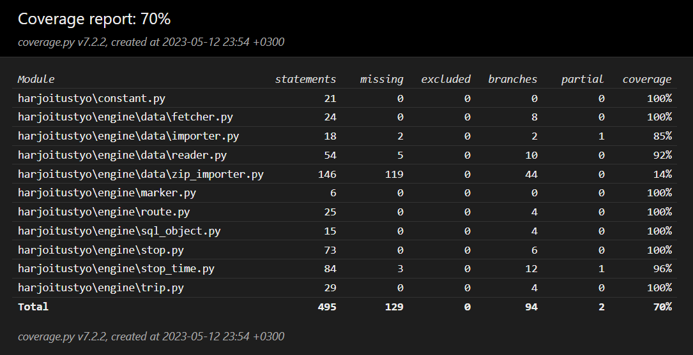

# Testaus

Sovelluksen luokkia ja niiden toiminnallisuutta testataan **pytest**:illä unit testein.

## Testikattavuus

Testatuilta osin coverage:n ilmoittama haaraumakattavuus on 70%.

## Tietojen importtaus

Tietojen importtausta kokonaisuudessaan ei testata, koska tietojen importtaaminen HSL.fi:stä ladatusta zip-tiedostosta tietokantaan kestää huomattavan määrän aikaa. Tätä ei toteutettu siksi, että vaikka tämän testaus olisi erittäin hyödyllistä, oletetaan että sovelluksen arvioija ei jaksa odotella näin pitkään. Tähän liittyvä sovelluslogiikka löytyy tiedostosta **harjoitustyo/engine/data/zip_importer.py** , mikä näkyykin haaraumakattavuudessa.

## Sovelluslogiikka

**harjoitustyo/engine/*.py**

Lähes kaikki toiminnallisuus testataan, toimivalla datalla ja osin virheellisellä datalla. Tämä sisältää sovelluksen toteuttamiseen tarvittavat data classit.

**harjoitustyo/engine/data/*.py**

Huomaa, että testauksen onnistuminen riippuu zip-tiedoston lataamisesta HSL.fi:stä.

Dataa käsittelevistä luokista testataan muu toiminnallisuus, paitsi:

- SQLite-tietokannan luontia ei testata
- tietokantaa ei testata synteettisellä (esim. virheellisellä) datalla
- zip_importer:ia ei testata, koska nykyisellä implementaatiolla datan importtaaminen kestää hyvin pitkään (kymmeniä minuutteja)

## Käyttöliittymå

**harjoitustyo/ui/**

tkinter:illä toteutettua käyttöliittymää ei testata.

## Järjestelmätestaus

Järjestelmätestausta varten ei ole erikseen toteutettu ohjelmallisia testejä.

## Asennus ja konfigurointi

Sovelluksen toimivuus on testattu Windows- ja Linux-ympäristössä, varmistaen, että perustoiminnallisus ei aiheuta virheilmoituksia.

## Sovellukseen jääneet laatuongelmat

Pysäkkiaikataulujen tiedot eivät ole nykyisessä implementaatiossa yhtenevät HSL.fi:ssä olevien pysäkkikohtaisten aikataulujen kanssa. Sovellusta voi pitää nykymuodossaan siis enemmän esimerkkinä tällaisen sovelluksen toteuttamisesta kuin luotettavana tietolähteenä.
