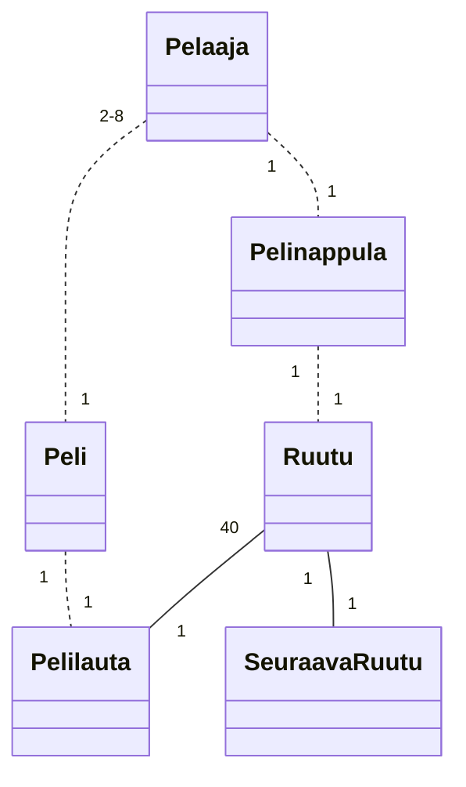

# Tehtävä 1

Monopoli-kaavio.

```mermaid
classDiagram
    %% a game of Monopoly contains 2-8 players
    Pelaaja "2-8" .. "1" Peli

    %% a game is played on one board
    Peli "1" .. "1" Pelilauta

    %% the board contains 40 tiles
    Ruutu "40" -- "1" Pelilauta

    %% a player has one piece
    Pelaaja "1" .. "1" Pelinappula

    %% a piece is on a tile
    Pelinappula "1" .. "1" Ruutu

    %% a tile has a link to the next tile
    Ruutu "1" -- "1" SeuraavaRuutu

    class Pelaaja
    class Peli
    class Pelilauta
    class Pelinappula
    class Ruutu
    class SeuraavaRuutu
```