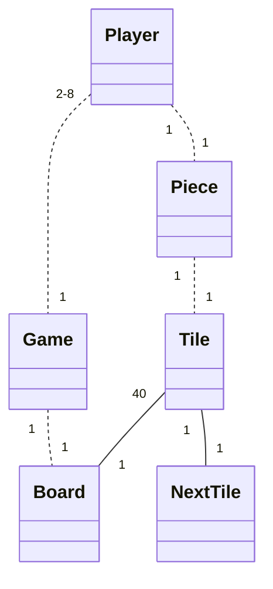

# Tehtävä 1

Monopoli-kaavio.

```mermaid
classDiagram
%% a game of Monopoly contains 2-8 players
Player "2-8" .. "1" Game

    %% a game is played on one board
    Game "1" .. "1" Board

    %% the board contains 40 tiles
    Tile "40" -- "1" Board

    %% a player has one piece
    Player "1" .. "1" Piece

    %% a piece is on a tile
    Piece "1" .. "1" Tile

    %% a tile has a link to the next tile
    Tile "1" -- "1" NextTile

    class Player
    class Piece
    class Game
    class Board
    class Tile
    class NextTile
```