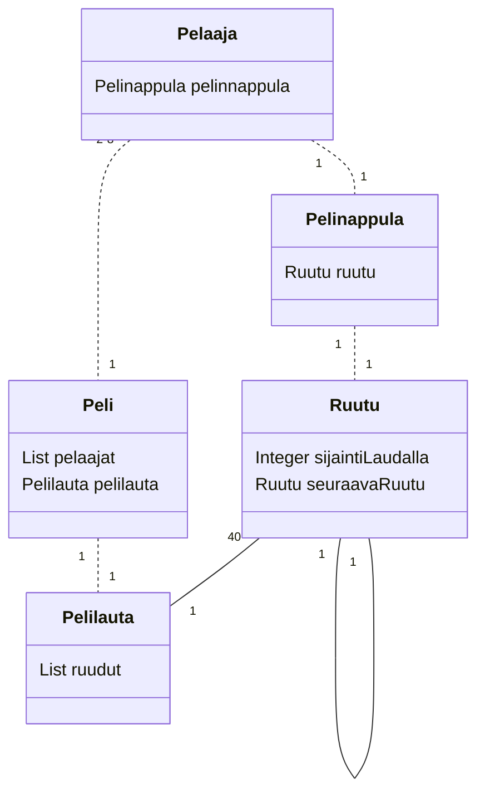

# Tehtävä 1

Monopoli-kaavio.

```mermaid
classDiagram
    %% a game of Monopoly contains 2-8 players
    Pelaaja "2-8" .. "1" Peli

    %% a game is played on one board
    Peli "1" .. "1" Pelilauta

    %% the board contains 40 tiles
    Ruutu "40" -- "1" Pelilauta

    %% a player has one piece
    Pelaaja "1" .. "1" Pelinappula

    %% a piece is on a tile
    Pelinappula "1" .. "1" Ruutu

    %% a tile has a link to the next tile
    Ruutu "1" -- "1" Ruutu

    %% a game has a link to the players and a board
    class Peli {
        List pelaajat
        Pelilauta pelilauta
    }

    %% a player has a link to a piece    
    class Pelaaja {
        Pelinappula pelinnappula
    }
    
    %% a piece is on a tile
    class Pelinappula {
        Ruutu ruutu
    }

    %% a board contains its tiles
    class Pelilauta {
        List ruudut
    }

    %% a tile has a link to the next tile on the board
    class Ruutu {
        Integer sijaintiLaudalla
        Ruutu seuraavaRuutu
    }   
```