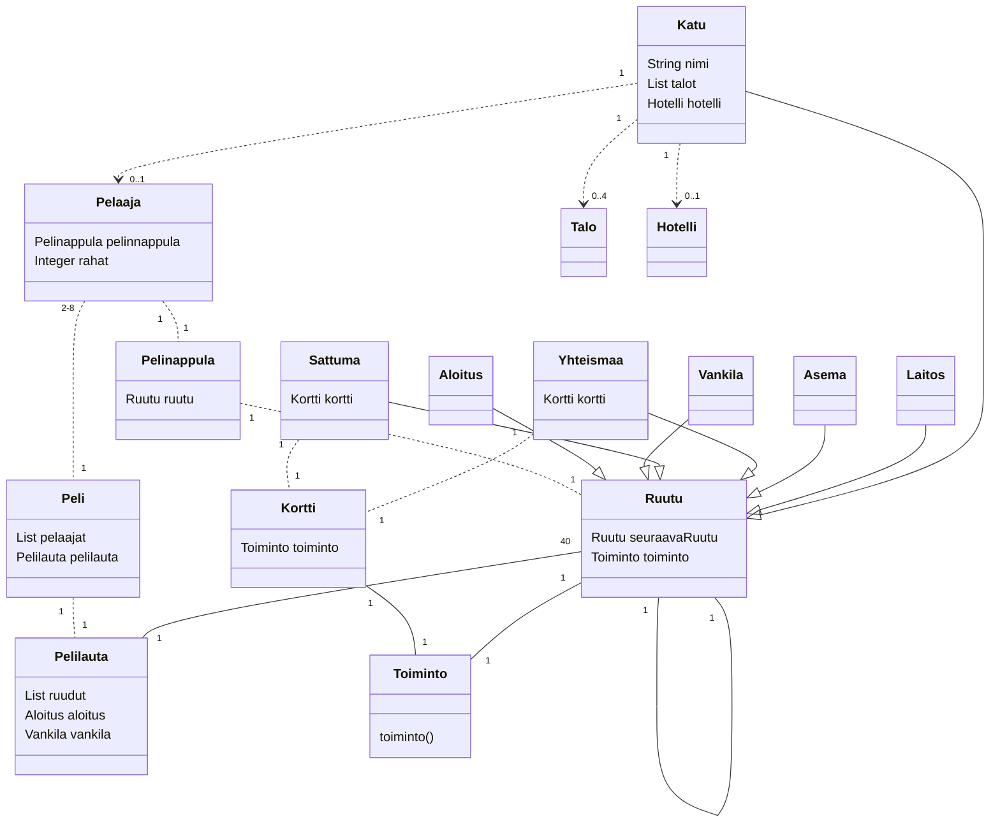

# Tehtävä 2

Laajennettu Monopoli-kaavio.

Korttityypit olisi voinut kenties toimitaa enumerate:na, eikä perittyinä luokkina. Tämä olisi selkiyttänyt kaaviota.

```mermaid
classDiagram
    %% a game of Monopoly contains 2-8 players
    Pelaaja "2-8" .. "1" Peli

    %% a game is played on one board
    Peli "1" .. "1" Pelilauta

    %% the board contains 40 tiles
    Ruutu "40" -- "1" Pelilauta

    %% a player has one piece
    Pelaaja "1" .. "1" Pelinappula

    %% a piece is on a tile
    Pelinappula "1" .. "1" Ruutu

    %% a tile has a link to the next tile
    Ruutu "1" -- "1" Ruutu

    %% a game has a link to the players and a board
    class Peli {
        List pelaajat
        Pelilauta pelilauta
    }

    %% a player has a link to a piece
    %% player also has some money (0 or more)
    class Pelaaja {
        Pelinappula pelinnappula
        Integer rahat
    }

    %% a piece is on a tile
    class Pelinappula {
        Ruutu ruutu
    }

    %% a board contains its tiles
    %% and has links to Aloitus & Vankila
    %% The board layout would be defined in ruudut
    class Pelilauta {
        List ruudut
        Aloitus aloitus
        Vankila vankila
    }

    %% different types of tiles (using inheritance)
    Aloitus --|> Ruutu
    Vankila --|> Ruutu
    Sattuma--|> Ruutu
    Yhteismaa --|> Ruutu
    Asema --|> Ruutu
    Laitos --|> Ruutu
    Katu --|> Ruutu

    Sattuma  "1" .. "1" Kortti
    Yhteismaa "1" .. "1" Kortti

    Kortti "1" -- "1" Toiminto
    Ruutu "1" -- "1" Toiminto

    class Talo

    class Hotelli

    %% a card has an action
    class Kortti {
        Toiminto toiminto
    }

    class Sattuma {
        Kortti kortti
    }

    class Yhteismaa {
        Kortti kortti
    }

    %% a street has a name, and: zero buildings OR one to four houses OR one hotelli
    class Katu {
        String nimi
        List talot
        Hotelli hotelli
    }

    Katu "1" ..> "0..1" Pelaaja
    Katu "1" ..> "0..1" Hotelli
    Katu "1" ..> "0..4" Talo

    %% a tile has a link to the next tile on the board
    %% a tile also has an action
    class Ruutu {
        Ruutu seuraavaRuutu
        Toiminto toiminto
    }

    class Toiminto {
        toiminto()
    }
```