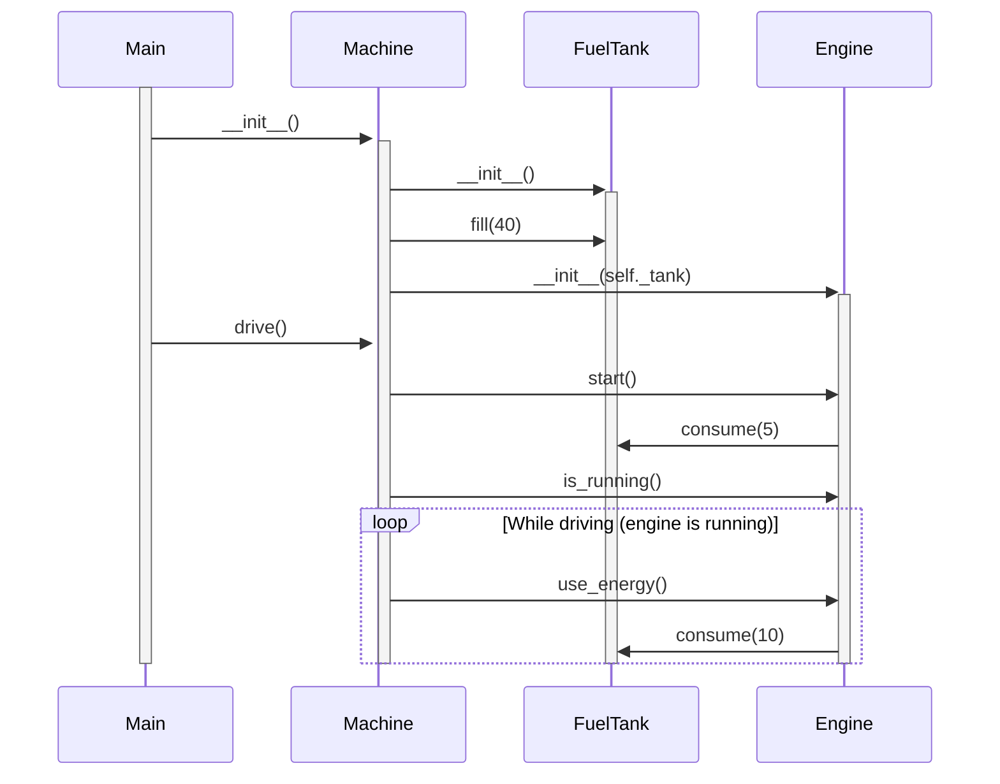

# Tehtävä 3

Ajamiseen liittyvä sekvenssikaavio.

**Huom!** Ei varsinaisesti mallinnettu bensiinin määrän tarkistusta. Tämän voisi kenties tehdä Mermaidin break-toiminnallisuudella. Huomioitu vain loop:issa (While driving).

