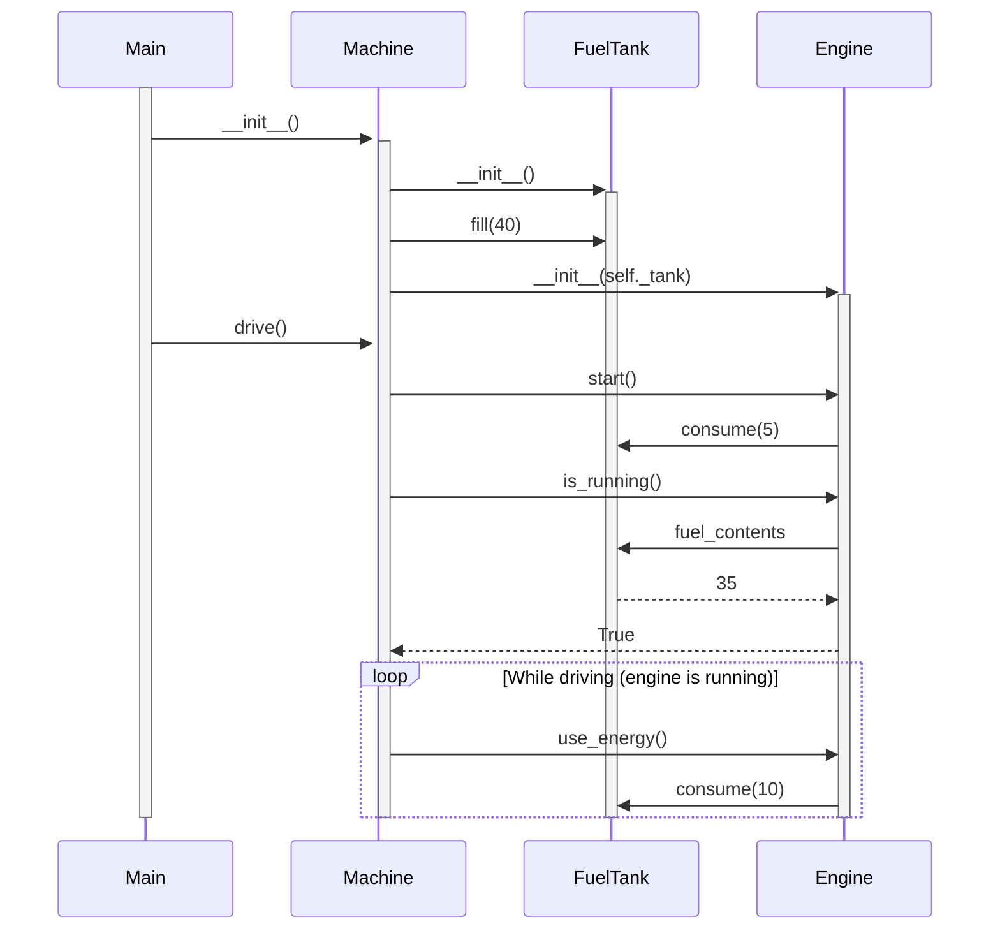

# Tehtävä 3

Ajamiseen liittyvä sekvenssikaavio.

**Huom!** Ei varsinaisesti mallinnettu bensiinin määrän tarkistusta. Tämän voisi kenties tehdä Mermaidin break-toiminnallisuudella. Huomioitu vain loop:issa (While driving).

Tehtävän koodissa ei myöskään ollut loop:ia, vaan enginen use_energy():ä kutsutaan vain kerran. Tuntui kuitenkin luontevalta laittaa mukaan tuo loop, koska ajaminen lienee toimintaa, joka jatkuu kunnes bensa loppuu tai ajaminen keskeytetään.

