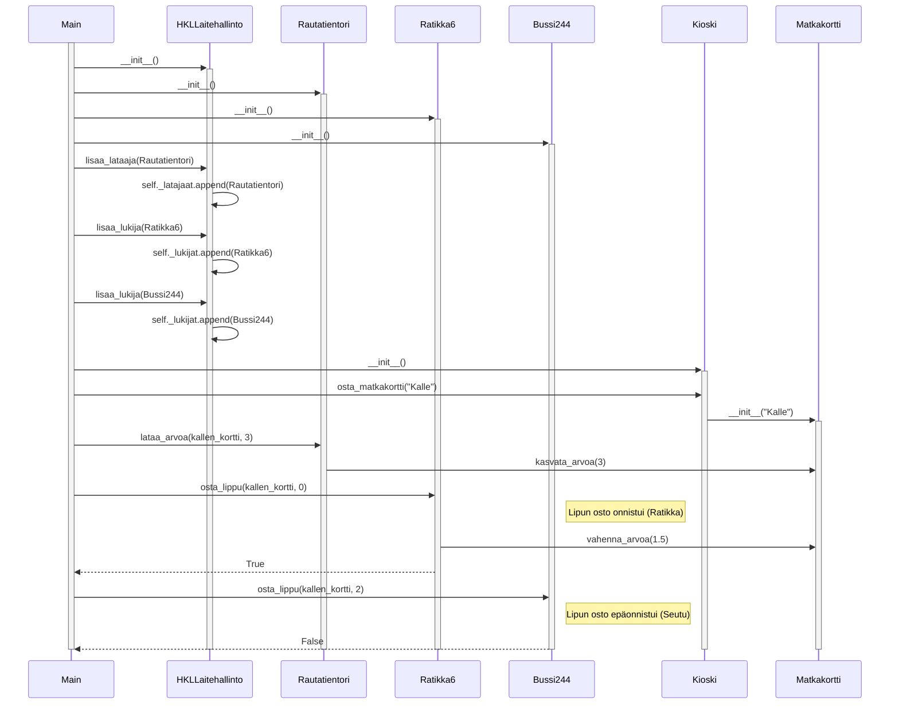

# Tehtävä 4

Joukkoliikenteen matkustussovelluksen sekvenssikaavio.

```mermaid
sequenceDiagram
%%participant Main
%%participant Machine
%%participant FuelTank
%%participant Engine

activate Main

Main ->> +HKLLaitehallinto: __init__()
Main ->> +Rautatientori: __init__()
Main ->> +Ratikka6: __init__()
Main ->> +Bussi244: __init__()

Main ->> HKLLaitehallinto: lisaa_lataaja(Rautatientori)
HKLLaitehallinto ->> HKLLaitehallinto: self._latajaat.append(Rautatientori)

Main ->> HKLLaitehallinto: lisaa_lukija(Ratikka6)
HKLLaitehallinto ->> HKLLaitehallinto: self._lukijat.append(Ratikka6)

Main ->> HKLLaitehallinto: lisaa_lukija(Bussi244)
HKLLaitehallinto ->> HKLLaitehallinto: self._lukijat.append(Bussi244)

Main ->> +Kioski: __init__()
Main ->> Kioski: osta_matkakortti("Kalle")

Kioski ->> +Matkakortti: __init__("Kalle")

Main ->> Rautatientori: lataa_arvoa(kallen_kortti, 3)
Rautatientori ->> Matkakortti: kasvata_arvoa(3)

Main ->> Ratikka6: osta_lippu(kallen_kortti, 0)
Note right of Bussi244: Lipun osto onnistui (Ratikka)
Ratikka6 ->> Matkakortti: vahenna_arvoa(1.5)
Ratikka6 -->> Main: True

Main ->> Bussi244: osta_lippu(kallen_kortti, 2)

Note right of Bussi244: Lipun osto epäonnistui (Seutu)
Bussi244 -->> Main: False

deactivate Rautatientori
deactivate Ratikka6
deactivate Bussi244
deactivate HKLLaitehallinto
deactivate Main
deactivate Matkakortti
deactivate Kioski
```
